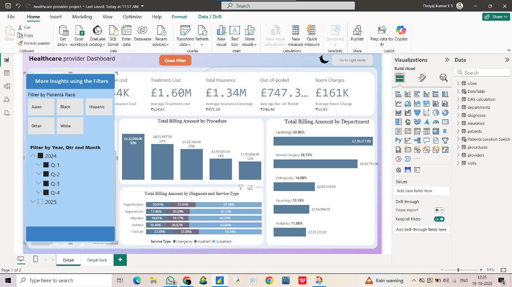
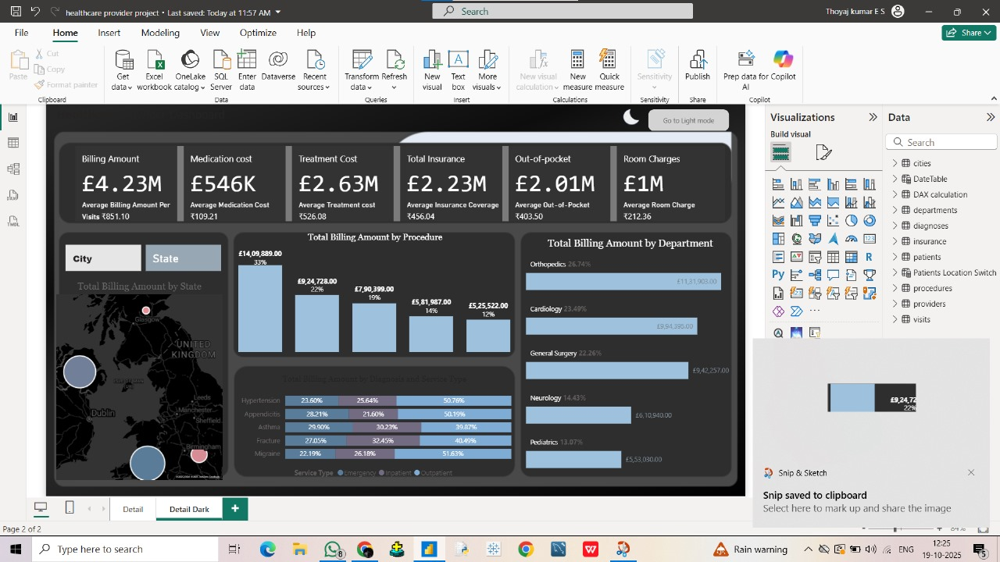

# 🏥 Healthcare Provider Power BI Dashboard

## 📊 Project Overview
The **Healthcare Provider Dashboard** is an interactive **Power BI** report designed to analyze and visualize billing and treatment costs across different procedures, departments, and patient demographics.

It provides healthcare administrators and analysts with valuable insights into **revenue trends, insurance coverage, treatment expenses,** and **out-of-pocket costs** — helping them make **data-driven decisions** for cost optimization and operational efficiency.

---

## 🧠 Key Insights
- 💰 **Total Billing & Cost Breakdown** — Treatment, insurance, and out-of-pocket costs.  
- 🏨 **Department Performance** — Billing distribution across Cardiology, Orthopedics, Neurology, Pediatrics, etc.  
- 🧾 **Procedure-Level Analysis** — Identify top revenue-generating medical procedures.  
- ⚕️ **Diagnosis Insights** — Compare emergency, inpatient, and outpatient service types.  
- 🗺️ **Geographical Overview** — Map visuals show billing by **city** and **state** across the UK.  
- 👥 **Demographic Filters** — Analyze data by **patient race**, **year**, and **quarter**.

---

## 📈 Dashboard Features
- 🎨 Clean & modern **UI design** with both **Light** and **Dark** themes.  
- 🧭 **Interactive filters** for year, quarter, and patient race.  
- 📊 Dynamic visuals powered by **DAX calculations**.  
- 🧩 KPIs summarizing key metrics:
  - Billing Amount  
  - Treatment Cost  
  - Insurance Coverage  
  - Out-of-Pocket Expenses  
  - Room & Medication Costs

---

## 🧩 Tools & Technologies
| Tool / Technology | Purpose |
|--------------------|----------|
| **Power BI Desktop** | Dashboard creation & visualization |
| **DAX (Data Analysis Expressions)** | Measure calculations |
| **Excel / SQL** | Data preparation & cleaning |
| **Power Query Editor** | Data transformation |
| **Map Visuals** | Geo analysis by City & State |

---

## 📂 Dashboard Pages
### 1️⃣ Detail Dashboard (Light Mode)
Focuses on **procedure-wise** and **diagnosis-based** billing with demographic filters.

### 2️⃣ Detail Dark Dashboard (Dark Mode)
Enhanced presentation view emphasizing **state-wise** and **departmental** analysis.

---

## 📷 Dashboard Preview

| Light Mode | Filter View | Dark Mode |
|-------------|--------------|-----------|
|  |  |  |

---

## 💡 Business Impact
This dashboard enables healthcare administrators to:
- Monitor and compare **billing performance** across departments.  
- Identify **high-cost procedures** or underperforming segments.  
- Optimize **patient billing & insurance** operations.  
- Support **strategic healthcare planning** using regional insights.

---

## 🚀 Future Enhancements
- 🔄 Enable **real-time data refresh** with Power BI Service.  
- 📈 Integrate **predictive analytics** for cost forecasting.  
- 🧍 Add **patient satisfaction & efficiency KPIs**.  
- 🌐 Expand analysis to **multi-location healthcare networks**.

---

## 👨‍💻 Author
yamini sirisha 

_Data Analytics & Business Intelligence Enthusiast_  

🔗 [GitHub Profile](https://github.com/yaminisirisharoyals)  
💼 [LinkedIn Profile](https://www.linkedin.com/in/yamini-sirisha28/)

---

⭐ **If you like this project, give it a star on GitHub!**
